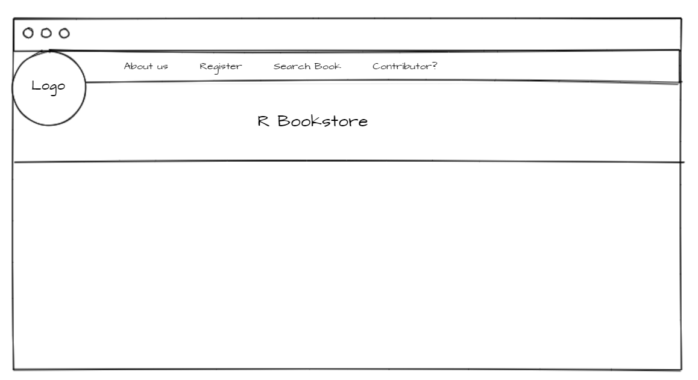
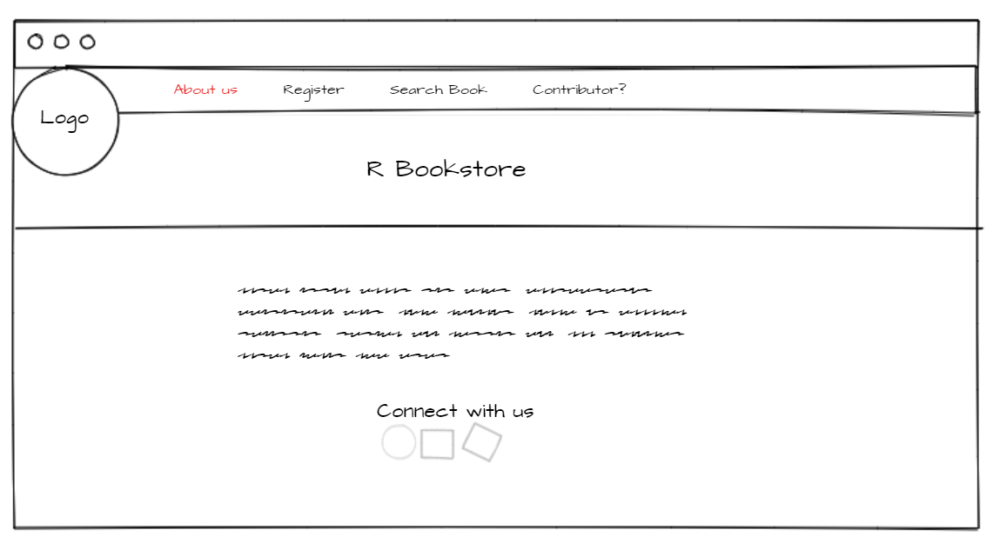
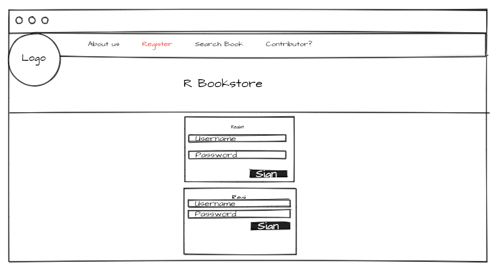
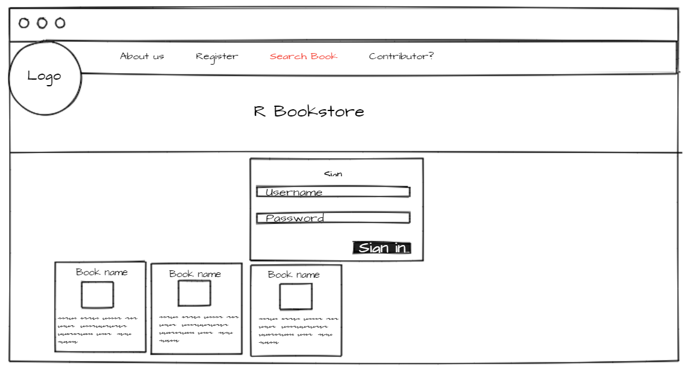
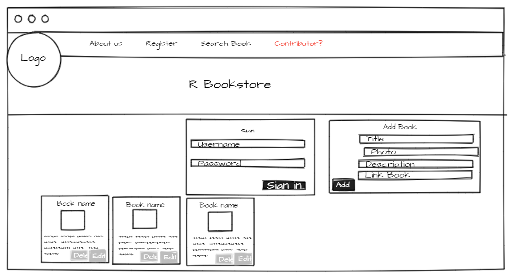
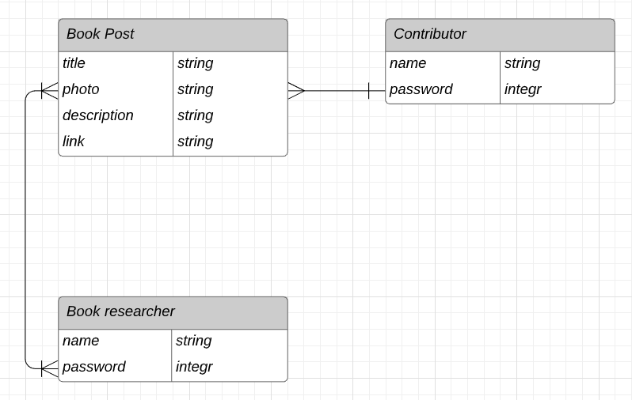

#[](https://generalassemb.ly/education/web-development-immersive)


# R Bookstore 

### Table of Contents
* [Overview](#overview)
* [Live Application URL](#live-application-url)
* [Technologies](#technologies)
* [Wireframes](#wireframes)
* [ERD](#erd)
* [User Story](#user-story)
* [Prerequisites](#prerequisites)
* [Version 2](#version-2)
* [Resources](#resources)
​
## Overview

It is a website that helps students or anyone who wants to search for a reference or books that helps them through this site, and also anyone who wants to contribute to publishing a reference or books.
​
## Live Application URL
 Loading ...
​
## Technologies
##### MERN Stack Project:
* React js
* Express
* MongoDB
* Mongoose
* node.js
* CLI
* Postman
* VS code
* JSX
​
​
## Wireframes
 
 
 
 
 

## ERD
 

## User Story

###### Version 1:
As a book researcher :
should be able to register.
should be able to login.
should be able to show the books that I have chose at it .
should be able to see the all books publish .
should be able to leave book was chose before .
should be able to logout .


As a contribuotre :
should be able to register.
should be able to login.
should be able to show all the refernces that I have published.
should be able to add a new books .
should be able to edit any books .
should be able to delete any books .
should be able to logout .

​
## Prerequisites
​
### Install Node JS
​
 https://nodejs.org/en/ to install nodejs
​
### Install create-react-app
​
Install create-react-app npm package globally. to run the project easily, install it by this command below 
​
```bash
npm install -g create-react-app
```
​
### Cloning and Running the Application in local
​
Clone the project into local
​
Install all the npm packages. Go into the project folder and type the following command to install all npm packages
​
```bash
npm install
```
​
In order to run the application on your computer Type the following command
​
```bash
npm start
```
​
Usually The Application Runs on **localhost:3000**

## Version 2
- Improve design.
- More interactive.
​

## Resources
- **[React.js](https://reactjs.org/)**
- **[mongoose](https://mongoosejs.com/)**
- **[express](https://expressjs.com/)**